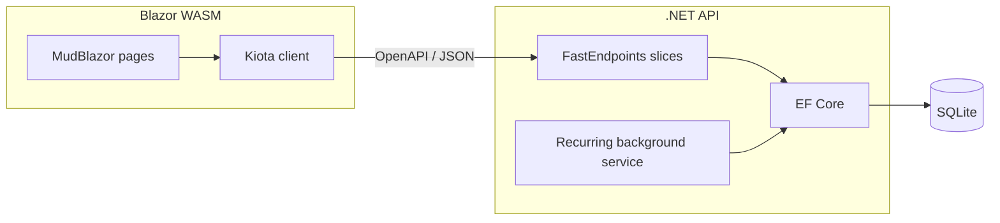

# Trackr

Personal finance tracker built with **.NET 10**, **Blazor WebAssembly**, and a contract-first API. Track accounts, categorize spending, review a dashboard, and automate rent-style payments with recurring rules and a background worker.

> Portfolio project — demonstrates full-stack .NET architecture, vertical-slice API design, generated API clients, and pragmatic UI patterns without heavy frameworks.

---

## Highlights

| Area | What it shows |
|------|----------------|
| **API design** | FastEndpoints vertical slices — one folder per use case (endpoint, handler, validator, DTOs) |
| **Contract-first client** | OpenAPI → [Kiota](https://learn.microsoft.com/en-us/openapi/kiota/) — no hand-written HTTP DTOs in the frontend |
| **Data layer** | EF Core + SQLite, code-first migrations, server-side pagination |
| **Frontend state** | Lightweight `QueryState` / `MutationState` helpers (TanStack Query–inspired, no extra package) |
| **Background jobs** | `IHostedService` + periodic timer posts due recurring transactions (no Hangfire/Quartz) |
| **Ops** | Docker Compose (API + static WASM host), health checks, structured Serilog logging |

---

## Features

- **Dashboard** — income, expenses by priority (essential / important / discretionary), net savings, expenses by category, account balances
- **Accounts** — checking, savings, cash, credit card; soft archive; running balance from ledger
- **Categories** — income/expense tree, expense priority, sort order
- **Transactions** — income, expense, transfer; filters, CSV export, paginated server-side table
- **Recurring transactions** — weekly, biweekly, monthly, yearly schedules; auto-post via background job; manual **Run now**; catch-up for missed periods

---

## Tech stack

**Backend** — .NET 10, FastEndpoints, EF Core (SQLite), FluentValidation, Serilog, Scalar (OpenAPI UI)

**Frontend** — Blazor WebAssembly, MudBlazor, Kiota-generated API client, PWA service worker

**Tooling** — Docker, xUnit (schedule + generation tests)

---

## Architecture



Recurring flow: a hosted service polls for due rules → generation service validates and inserts `Transaction` rows → idempotent unique index on `(RecurringTransactionId, OccurredOn)` prevents duplicates.

---

## Getting started

### Prerequisites

- [.NET 10 SDK](https://dotnet.microsoft.com/download)
- [Docker](https://www.docker.com/) (optional, recommended for the API)

### Quick start (Docker)

From the repo root:

```bash
docker compose up -d
```

| Service | URL |
|---------|-----|
| Web UI | http://localhost:5081 |
| API | http://localhost:5080 |
| OpenAPI (dev) | http://localhost:5080/scalar/v1 |

SQLite data persists in the `trackr-data` Docker volume.

### Local development (UI work)

Run the **API in Docker** and the **Blazor app on the host** so Razor hot reload works without rebuilding the nginx image.

1. Start the API:

   ```bash
   docker compose up -d api
   ```

2. Run the frontend (F5 on `src/frontend/frontend.csproj`, or):

   ```bash
   dotnet watch run --project src/frontend
   ```

   Dev settings in `wwwroot/appsettings.Development.json` point `ApiBaseUrl` at `http://localhost:5080`.

3. CORS allows Blazor dev origins (`http://localhost:5247`, `https://localhost:7205`) and the Docker web host. After changing compose env vars: `docker compose up -d --force-recreate api`.

### Backend only (no Docker)

```bash
dotnet run --project src/backend
```

Migrations apply automatically in Development. API listens on the URL in `launchSettings.json`.

### Regenerate API client

After changing backend endpoints, start the API and run:

```powershell
./scripts/generate-api.ps1
```

Output: `src/frontend/TrackrApi/` (do not hand-edit generated files).

### Tests

```bash
dotnet test tests/backend.Tests/backend.Tests.csproj
```

Covers recurring schedule math (month-end, leap years, biweekly anchors) and transaction generation idempotency.

---

## Project structure

```
trackr/
├── src/
│   ├── backend/           # .NET API — Features/<Domain>/<Action>/ slices
│   └── frontend/          # Blazor WASM — Features/<Domain>/ pages & dialogs
│       └── TrackrApi/     # Kiota-generated client
├── tests/backend.Tests/
├── scripts/generate-api.ps1
└── docker-compose.yml
```

---

## API overview

REST JSON under `/api/*`. Errors use RFC 7807 Problem Details.

| Resource | Examples |
|----------|----------|
| Accounts | `GET/POST /api/accounts`, `POST .../archive` |
| Categories | `GET/POST /api/categories` |
| Transactions | `GET/POST /api/transactions`, `GET .../summary`, `GET .../export` |
| Recurring | `GET/POST /api/recurring-transactions`, `POST .../generate-now` |

---

## License

This project is for portfolio and learning purposes. Use and adapt as you like.
